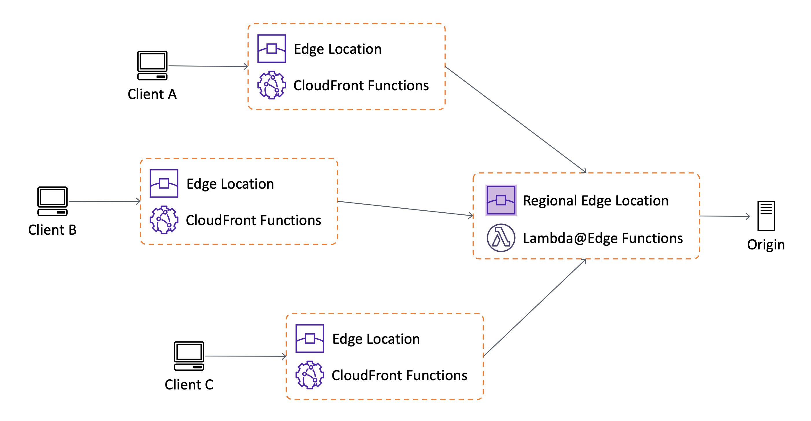
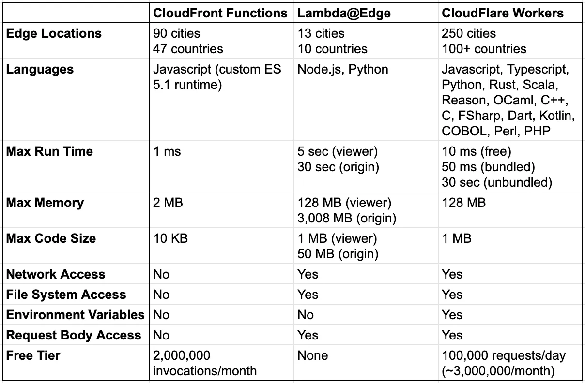

# Edge Computing

> 에지 컴퓨팅(edge computing)은 응답 시간을 개선하고 대역폭을 절약하기 위해 필요한 곳에 연산과 데이터 스토리지를 도입하는 분산 컴퓨팅 패러다임의 하나

## 사용 예

아래로 갈수록 무거운 연산이 필요하기에 사용자와 가깝지만 제약에 걸릴 가능성이 높아지기에 만들고자 하는 어플리케이션이 제약사항을 만족하는지 고려가 필요

- 정적 웹 사이트 콘텐츠 전달 가속화
- 사용자 지정 응답 캐시
- 조건부 응답 혹은 응답 수정
- URL 리디렉션 또는 재작성
- 원본 요청에 대한 인증 및 인가 관리
- 사용자 지정 로드 밸런싱 및 failover 로직
- A/B 테스팅
- 온라인 대기표 서비스
- 간단한 서버 어플리케이션
- 이미지 리사이징 및 캐시
- 주문형 비디오 또는 라이브 스트리밍 비디오 제공

## CloudFront Functions & AWS Lambda@Edge

AWS에서 실행되는 서버리스 엣지 컴퓨팅 서비스로 AWS Lambda에 제약 사항이 추가되는 대신 사용자 가까운 위치에서 서빙되기에 비교적 빠른 응답을 가능케 함

- `CloudFront Functions`은 218개 [CloudFront Edge Locations](https://aws.amazon.com/ko/cloudfront/features/?whats-new-cloudfront.sort-by=item.additionalFields.postDateTime&whats-new-cloudfront.sort-order=desc#Global_Edge_Network)에서 실행
- `AWS Lambda@Edge`은 가장 가까운 [AWS 리전](https://aws.amazon.com/ko/about-aws/global-infrastructure/regions_az/)에서 실행
- `CloudFront Functions` > `AWS Lambda@Edge` > `AWS Lambda` 순서로 빠른 실행을 보장하며, 역순으로 제약 사항이 완화됨

## Cloudflare Workers

CDN으로 잘 알려진 Cloudflare 엣지 로케이션에서 실행되는 서버리스 컴퓨팅 서비스

### 지원 언어

- JavaScript, TypeScript
- Rust, C, Cobol (Wasm)
- Kotlin, Dart, Python etc (compile to JS)

### 지원 플랫폼

- KV: key/value storage (Redis like)
- R2: object storage (S3 like)
- Durable Objects: transactional key/value storage
- D1: SQL databases (base on SQLite)
- Queues: message broker
- Constellation: machine learning models
- Wrangler: console project initializer

## AWS vs Cloudflare 비교표

## 기타 서비스

- [Fastly Compute@Edge](https://www.fastly.com/products/edge-compute)
  - GraphQL CDN 서비스인 Stellate가 Fastly에서 [서비스 중](https://stellate.co/docs/platform/edge-locations)
- [Fly.io](https://fly.io/docs/)

### 출처

- [위키백과 에지 컴퓨팅](https://ko.wikipedia.org/wiki/%EC%97%90%EC%A7%80_%EC%BB%B4%ED%93%A8%ED%8C%85#cite_note-ED_CP_01-1)
- [CloudFront Functions: 20% faster than Cloudflare Workers, 230% faster than Lambda@Edge](https://medium.com/@pauly4it/cloudfront-functions-20-faster-than-cloudflare-workers-230-faster-than-lambda-edge-c65c26221296)
- [What is Amazon CloudFront?](https://docs.aws.amazon.com/AmazonCloudFront/latest/DeveloperGuide/Introduction.html)
- [Lambda@Edge](https://aws.amazon.com/ko/lambda/edge/)
- [Cloudflare Docs](https://developers.cloudflare.com/workers/)